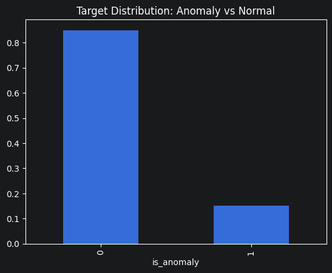
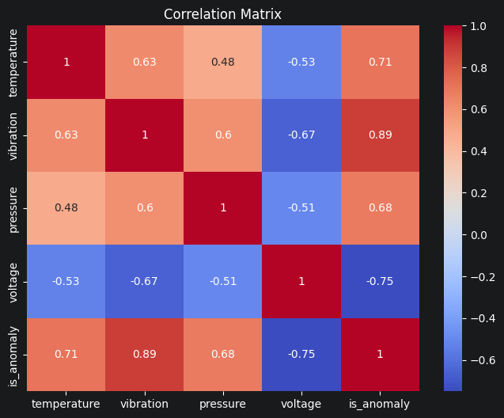

# Система обнаружения аномалий (IoT Telemetry ML Pipeline)

Данный проект реализует распределенный пайплайн для потоковой обработки телеметрических данных IoT, обучения модели машинного обучения в реальном времени и визуализации метрик с использованием Apache Kafka, XGBoost и Streamlit. Проект спроектирован с учетом требований отказоустойчивости и изолированной микросервисной структуры.

## Описание набора данных

Для обучения и тестирования используется набор данных IoT-телеметрии, созданный скриптом генерации. Общий объем составляет **500 000 непрерывных записей**.



**Вывод по распределению:** датасет является несбалансированным (~85% нормы против ~15% аномалий), что характерно для реальных задач. Подобный дисбаланс диктует необходимость использования метрики AUC-ROC вместо обычной Accuracy для объективной оценки качества модели.

Каждая запись содержит следующие признаки:
- `temperature`: Температура оборудования.
- `vibration`: Частота вибрации.
- `pressure`: Давление.
- `voltage`: Напряжение оборудования.
- `is_anomaly`: Целевая переменная для задачи классификации (1 — сбой/аномалия, 0 — штатный режим работы оборудования). Средняя вероятность аномалии в наборе составляет 15%.


**Вывод по корреляциям:** Матрица демонстрирует четкую линейную зависимость целевой переменной `is_anomaly` от датчиков вибрации, температуры и напряжения. Это подтверждает, что сбои в оборудовании непременно сопровождаются физическими изменениями (рост температуры, падение напряжения), которые модель непрерывного обучения сможет эффективно улавливать.

## Архитектура проекта

Кодовая база написана с применением паттернов ООП (классы Продюсеров и Консьюмеров вынесены в отдельный модуль `src/kafka_clients.py`) и состоит из следующих узлов:
1. **Kafka Cluster**: Развернут кластер из двух брокеров (`kafka-0` и `kafka-1`), работающих в новейшем режиме KRaft (без Zookeeper).
2. **Инициализатор (`init-kafka`)**: Модуль, использующий API `AdminClient` для программного конфигурирования топиков `topic_data` и `training_metrics` с установленным фактором репликации (`replication_factor=2`) до запуска основных подсистем.
3. **Data Producer**: Непрерывно считывает генерируемый датасет и публикует поток событий IoT-сенсоров в основную шину Kafka.
4. **Machine Learning Consumer**: Принимает потоковые данные мини-батчами. Выполняет потоковое дообучение модели **XGBoost** и отправляет полученные на тестовой подвыборке валидационные метрики (Log Loss, RMSE, MAE, Error, AUC) в топик метрик.
5. **Streamlit Analytics**: Получает показатели обучения и визуализирует их на интерактивном дашборде.
6. **Исследовательский модуль**: В окружении поднят Jupyter-сервер, содержащий ноутбук `EDA_ml.ipynb` для предварительного разведочного анализа датасета.

---

## Тестирование отказоустойчивости

Кластер спроектирован устойчивым к потере сетевых узлов. Благодаря фактору репликации `2` для всех топиков, данные зеркалируются брокерами. 
Для тестирования резервирования допускается симуляция аппаратного сбоя. Вы можете принудительно остановить один из контейнеров во время активной потоковой передачи (например, `docker stop kafka-0`). В данном сценарии система автоматически переведет потоки на резервный узел `kafka-1` без потери данных или разрушения ML-пайплайна.

## Объяснение поведения графиков метрик

При анализе дашборда на ранних этапах работы модели могут наблюдаться специфические паттерны:
- **Высокий AUC-ROC (~1.0)**: Столь высокое качество предсказания обусловлено выраженными девиациями признаков (скачки температуры и давления) в случае возникновения аномалии, с которыми градиентный бустинг XGBoost справляется предельно эффективно.
- **Особенности графика Error**: Модель обучается малыми батчами (размер 50). Разбиение данных для теста (`test_size=0.30`) означает, что тестовая подвыборка составляет ровно 15 сэмплов на каждый батч. Модель почти всегда безошибочно классифицирует набор (`error = 0.0`). Однако единичная ошибка приведет к штрафу в 1/15, что математически сформирует точный кратковременный скачок графика на уровень `~0.067`.

---

## Запуск 

Для развертывания проекта требуются установленные **Docker** и **Docker Compose**.

1. Склонируйте репозиторий и перейдите в его корневую директорию.
2. В терминале выполните команду для сборки и запуска кластера в фоновом режиме:
   ```bash
   docker compose up -d --build
   ```
3. Дашборд с метриками обучения доступен по адресу: [http://localhost:8501/](http://localhost:8501/)
